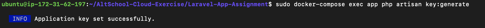

# **DOCKER LARAVEL APP**

## __STEPS TAKEN USING AWS EC2 INSTANCE__
 

### __*Install Docker*__
<li> Using the docker install process, docker and docker compose are installed on the instance.
 
See link below:

[Install Docker on Ubuntu 220.04](https://docs.docker.com/engine/install/ubuntu/)

[Install Docker Compose](https://docs.docker.com/compose/install/linux/)

 

### __*Git Clone Laraval Repo*__
<li> Using https://github.com/f1amy/laravel-realworld-example-app.git the laravel app was download to my local machine and then push to my current repo so that the Laravel app could be ran from my repo. As you can see the Laravel app is on my Repository.

 
 

### __*Edit the Web.php*__
<li> Uncomment out a few things in web.php in routes folder in the laravel app so that the laravel page will show on the browser and not a 404 page.

 

*See the screenshot below*
 

 
 

### __*Create the docker folder*__
<li> Using "mkdir docker" you will create a docker file directory in the laravel app folder. Inside the folder you will create the mysql folder, nginx folder and php folder.

 

*See the screenshot below*
 

 
 

### __*mysql folder*__
<li> This will house the content of the db.cnf.

 

*See the screenshot below*
 

 
 

### __*nginx folder*__
<li> This will house the content of the laravel.conf.

 

*See the screenshot below*
 

 
 

### __*php folder*__
<li> This will house the content of the php.ini.

 

*See the screenshot below*
 

 
 

### __*Create Dockerfile*__
<li> Contents of the Dockerfile. This file will be in the docker directory created above.

 

*See the screenshot below*
 

 
 

### __*Create .env*__
<li> Copy the .env example in the laravel app and edit the new .env file created.

 

*See the screenshot below of edit*
 

 
 

### __*Create docker-compose.yml*__
<li> Create a docker-compose.yml.

 

*See the content below*
 

 
 

## __Docker Commands to Run After the Above__
 

<li> sudo docker-compose build app
 

*See the output below*
 

 

 

 

<li> sudo docker-compose up -d
 

*See the output below*
 

 
 

<li> sudo docker-compose ps
 

*See the output below*
 

 
 

<li> sudo docker-compose exec app ls -l
 

*See the output below*
 

 
 

<li> sudo docker-compose exec app rm -rf vendor composer.lock
 

<li> sudo docker-compose exec app composer install
 

*See the output below*
 

 
 

<li> sudo docker-compose exec app php artisan key:generate
 

*See the output below*
 

 
 

NOTE: No migration was run on this laravel app
 
 
 
 

## __LARAVEL APP SHOWING ON IP ADDRESS__
 

*See the output below*

 

 
